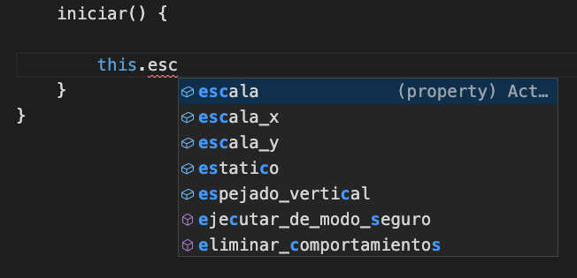
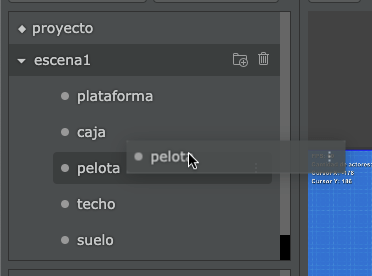
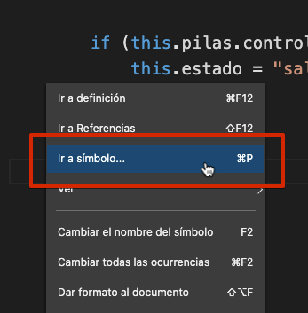
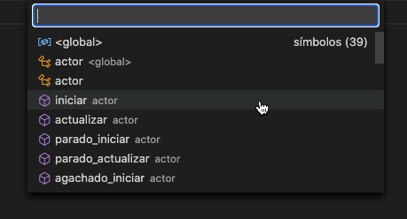

El editor de código tiene varias funcionalidades para ayudarte a escribir código
de manera rápida y cómoda.

En esta sección te vamos a resumir algunas de esas funcionalidades:

## Autocompletado

Siempre que escribas código, el editor intentará anticiparse a lo que escribas
para mostrar sugerencias:



Además, si estás escribiendo la llamada a un método el editor te mostrará los
argumentos que podrías incluir:


En este caso, el método decir admite dos argumentos: un mensaje y una duración. Notá
que la duración tiene un símbolo de pregunta, lo que indica que ese argumento es opcional.

## Obtener referencias a actores

Para obtener referencias rápidas a los actores puedes simplemente "arrastrar y soltar" los
actores sobre el código del editor:



Cuando el editor detecte que arrojaste un actor sobre el editor va a escribir una linea de
código como esta:

```typescript
let pelota = this.pilas.obtener_actor_por_nombre("pelota");
```

Lo que es bastante útil, porque nos evita escribir ese código.

Y si el actor que arrastramos sobre el editor es un actor desactivado, el editor va a colocar
este código en su lugar:

```typescript
let pelota = this.pilas.clonar("pelota");
```

## Fragmentos rápidos de código

Además del autocompletado el editor nos permite escribir fragmentos rápidos, por ejemplo
si escribis "observar" y pulsas enter, el editor va a autocompletar este texto:

```typescript
this.pilas.observar("x", this.x);
```

Además va a situar el cursor en la posición para que podamos personalizar esta linea de código
rápidamente.

Otros de los fragmentos rápidos que incluye el editor son los siguientes:

- `pilas`
- `clonar`
- `clonar_en`
- `control`
- `animar`

Te recomendamos probar escribir alguno de estos atajos para familiarizarte, sobre todo
el fragmento `control` que es bastante completo.


## Navegar métodos rápidamente

Cuando tenemos un actor con muchos métodos es aconsejable hacer búsquedas en lugar de
recorrer el código hacia arriba y abajo con la barra de scroll.

Para buscar métodos por nombres se puede pulsar el botón derecho del mouse sobre el
editor y seleccionar la siguiente opción:



Luego vas a notar que aparecerá una barra de búsqueda con todos los métodos del
actor, simplemente escribí o selecciona el método al que quieras ingresar.



Ten en cuenta que también puedes activar esta funcionalidad pulsando `ctrl+P` como
atajo.
