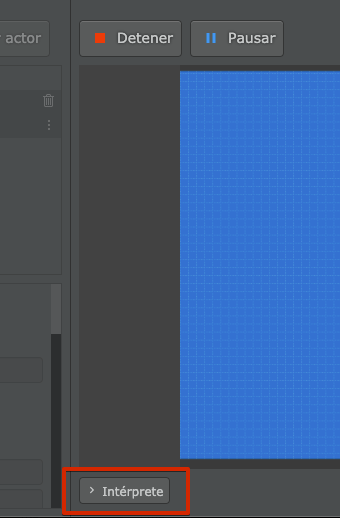
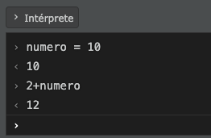
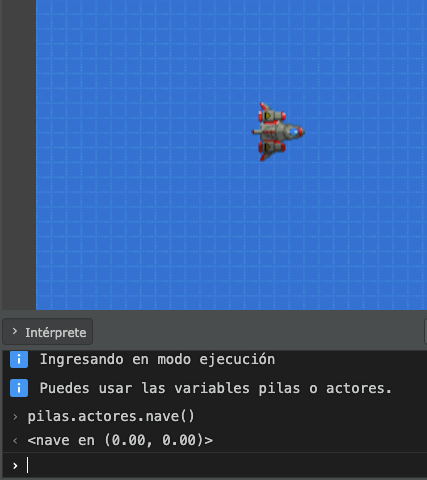
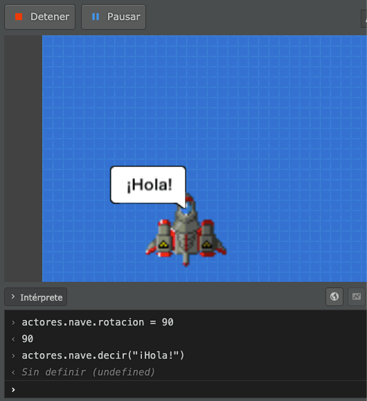

Programar se parece un poco a mantener una conversación con la computadora, le enviamos mensajes y esperamos una devolución de su parte. Por ese motivo, para poder hacer un juego que pueda ejecutar una computadora podemos usar un "lenguaje de programación" que entendamos tanto personas como computadoras.

Aquí es donde entra en juego una pieza de Pilas llamada "Intérprete". El intérprete es como un *chat* en donde podemos comunicarnos directamente con la computadora y esperar respuestas.

Para mostrar brevemente lo que puede hacer el intérprete pulsá el botón "Ejecutar", y luego hace click en ese botón que aparece debajo del area de juego a la izquierda:



Cuando pulses ese botón debería abrirse un area rectangular de esta forma:


Lo primero que aparece en esta pantalla son dos mensajes que nos envía pilas avisando que ingresamos en el modo ejecución, es decir, el juego está en funcionamiento. Y por el otro lado nos dice que hay dos variables para usar "pilas" y "actores".

Pero antes de hablar de variables, vamos a probar exactamente qué nos permite hacer el intérprete.

En el intérprete podemos escribir código y la computadora nos va a responder.

Hagamos una prueba, escribí  `2+2` en el intérprete así probamos la interacción con la computadora. 

En area en donde se puede escribir es la que está marcada con ese cursor `›`:


Luego pulsa la tecla "Enter" y la computadora te va a responder:


El intérprete va a responder a cada una de las cuentas con el resultado, como si fuera una calculadora aritmética.

Sin embargo, hace más que eso, si le pedimos incorrectamente algo nos dará un mensaje de error:

```typescript
2 + numero;
```


Y esto está bien, si bien el texto rojo parece algo grave, no lo es. La computadora nos explica que no sabe de que se trata "numero" y por lo tanto no sabría decirnos el resultado de esa cuenta.

Si le indicamos que el "numero" es `10` sí va a poder decirnos el resultado:

```typescript
numero = 10;
2 + numero;
```



¡Claro!, el resultado es `12` ya que creamos una variable llamada "numero" con el valor de 10.

## Accediendo a las variables pilas y actores

Ahora bien, el intérprete no solo puede realizar cuentas aritméticas, también nos da la posibilidad de realizar pruebas, crear o modificar los actores en la pantalla y varias cosas mas.

Al principio de esta sección mencioné que pilas nos avisaba que había dos variables listas para utilizar "pilas" y "actores":


Estas dos palabras se denominan variables, porque representan un nombre que almacena un valor asignado con anterioridad. En nuestro caso, "numero" también es una variable, porque básicamente es el nombre que le dimos al valor `10`.

Ahora bien, ¿qué podemos hacer con estas variables?.

La variable `pilas` nos permite acceder a todas las funcionalidades del motor. Si escribimos algo como:

```typescript
pilas.actores.nave()
```

Vas a notar que aparecerá una nave en la pantalla como respuesta al código que escribimos:



También vas a notar que en el intérprete aparece el mensaje `<nave en (0, 0)>`, esto es así para indicarnos que obedeció a nuestras orden. Pilas creó el actor nave y lo dejó en la posición `(0, 0)` de la pantalla.

Si haces click en la pantalla, vas a notar que la nave está "viva", se puede mover y disparar usando el teclado.


Ahora bien, aquí es donde entra en juego la otra variable que te comenté llamada "actores". Esta variable va a permitirnos referirnos a cualquier actor dentro de la escena.

Escribí estas lineas de código en el intérprete para ver el resultado:

```typescript
nave.escala = 2
nave.rotacion = 90
nave.decir("hola")
```

Lo que deberías ver es que la nave cambia de tamaño, apunta hacia arriba y además muestra un mensaje:



Esto es bastante útil, porque el código que escribimos en el intérprete también se puede trasladar al editor. Si tenemos dudas sobre alguna función o forma de hacer algo en pilas podemos probar en el intérprete, y si todo sale bien, llevarlo al editor y que forma parte de nuestro juego.

## Algunos consejos

El intérprete es algo bastante original en los motores de video juegos, pero se utiliza muchísimo en ambientes de desarrollo web y sistemas complejos.

Y como varias de las personas que usamos pilas venimos de ese mundo, el intérprete está diseñado en base a la experiencia de usar intérpretes durante muchos años... Un ejemplo de esto es el sistema de auto completado:

Siempre que escribas una variable conocida el intérprete va a intentar ayudarte a escribir código de esta forma:


Otra necesidad muy común es querer volver a repetir una instrucción anterior, para eso puedes pulsar las flechitas del teclado hacia arriba y abajo para navegar:


