Los lasers nos permiten detectar distancias y colisiones entre un actor y otros
mediante rectas.

Por ejemplo, en la siguiente imagen tenemos un actor con un laser para detectar
si existen plataformas debajo de sus pies:


Cada actor puede tener tantos lasers como quiera, la idea de esta característica
de pilas es que podamos permitirle a los actores detectar distancias y futuras
colisiones para reaccionar a ellas.

## Cómo crear lasers

Los lasers se pueden crear directamente desde el editor, tenemos que seleccionar
un actor y luego pulsar el botón "crear laser" dentro del panel de propiedades:

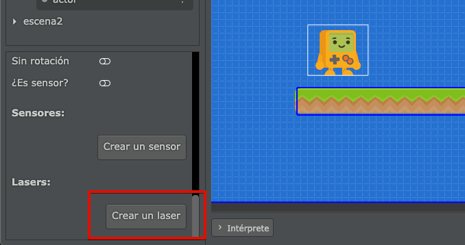

Una vez creado el laser, se tiene que ajustar la longitud y la rotación:

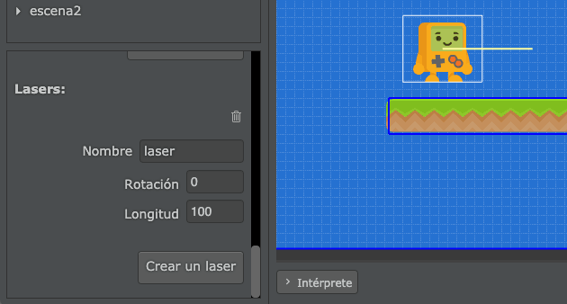

Por ejemplo, si nos interesa saber si el actor está cerca de tocar el suelo o
no, podemos reducir la longitud y colocar la rotación en `-90 grados` para que
el laser apunte hacia abajo:

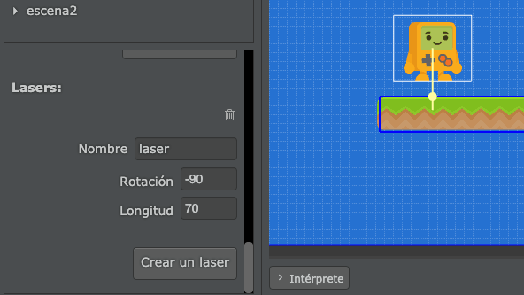

Vas a notar que los lasers reaccionan rápidamente a las colisiones con otros
actores dentro del editor. La linea del laser mostrará círculos en cada contacto
que realice contra otros actores:

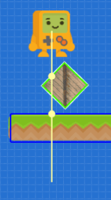

Eso sí, el laser solo detectará el contacto con aquellos actores que tengan una
figura física asignada. Por ejemplo aquí se reconocen colisiones con una caja y
la plataforma, pero no con la manzana (ya que no tiene figura física).

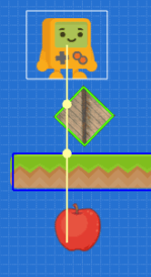


## Accediendo a los lasers desde el código

Una vez que creamos el laser desde el editor, podemos escribir código para
comenzar a interactuar con los sensores.

Veamos esto con un ejemplo, queremos que nuestro personaje detecte si está sobre
una plataforma o no. Así que podemos crear un sensor llamado "pies" y colocarlo
en dirección al suelo así:

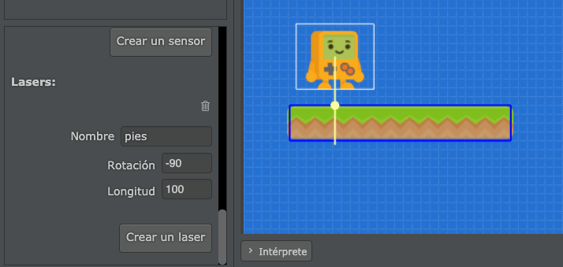

Ahora podemos ir al código del actor, crear un atributo llamado `pies` y luego
vincularle el sensor llamando a la función `obtener_sensor` así:

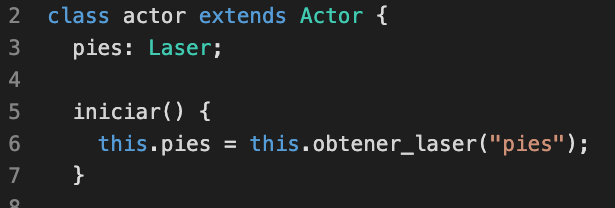

Y con ese código, ahora vamos a poder hacerle consultas en cualquier momento al
sensor que vinculamos. Estas son algunas de las funciones que incluyen los
sensores:

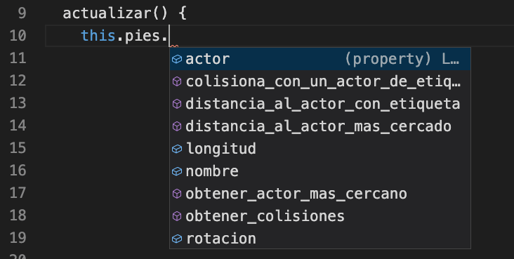

Tenemos funciones para consultar cuántos actores se encuentran en el camino del
laser, cual es el más cercano, a qué distancia está cada actor y muchas cosas
más.

Por ejemplo, podríamos hacer que el actor diga en todo momento a qué distancia
está el suelo usando esta función dentro del método `actualizar`:

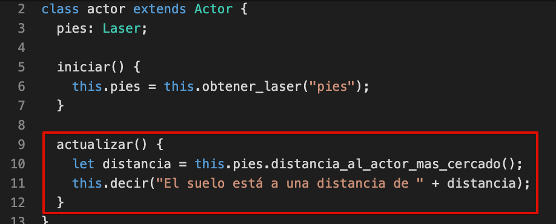

Y lo que deberíamos ver en la pantalla del juego, o ingresando en modo pausa, es
que el laser nos informa que hay `55 pixeles` entre el actor (desde donde
comienza el laser) hasta la primer colisión con la plataforma:

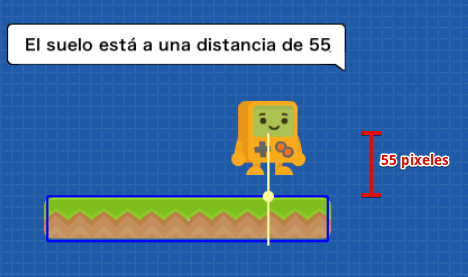

Ten en cuenta que la función `distancia_al_actor_mas_cercado` del laser, siempre
nos retornará un número. Y en caso de que no exista ningún actor cercano, el
número que nos retornará será igual a la longitud del laser. 

En este caso, como la longitud del laser es `100`, si no encuentra colisión con
nada nos retornará ese valor:

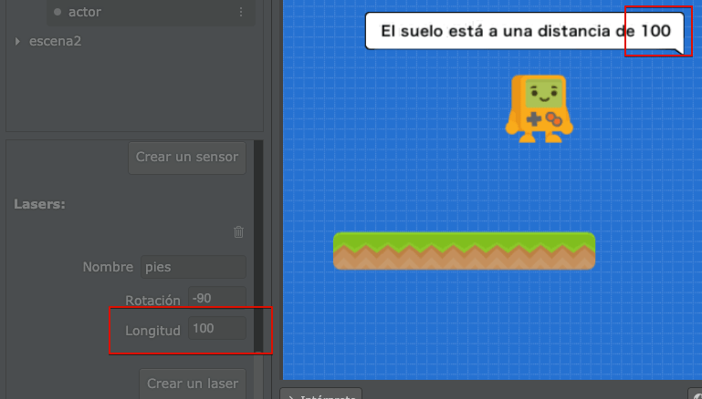

Al principio parece raro que nos retorne la longitud del laser, pero de hecho es
algo muy práctico, porque casi siempre las distancias se van a evaluar usando la
palabra reservada `if` y con alguna comparación.  

Observá este ejemplo, si queremos animar al actor de acuerdo a la distancia con
la plataforma podemos escribir un código en el método `actualizar` como este: 

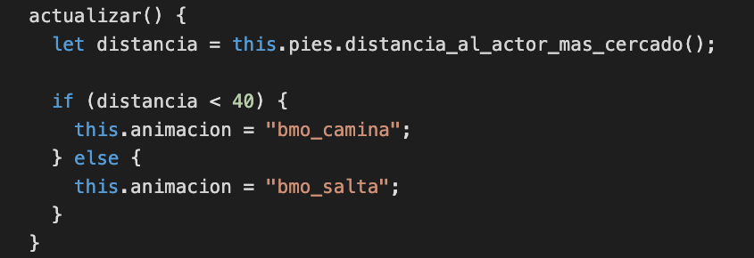

y el resultado va a ser similar a este:


Es decir, gracias a que el laser nos retorna la distancia como un número,
podemos decirle al actor que si la distancia es menor a `40` queremos que
muestre la animación "correr" y si esa distancia es mayor es porque tiene que
mostrar la animación de "salto".

## Avanzado: Lasers instantáneos desde el código

Los lasers que creamos desde el editor son ideales para visualizar, configurar
y comprender fácilmente de qué se trata este concepto de distancia y colisiones
en linea recta. 

Sin embargo, hay casos muy puntales en donde nos interesa calcular distancias o 
colisiones pero directamente desde el código. Para estos casos pilas incorpora
lasers "instantáneos".

Los lasers "instantáneos" se pueden crear con la función `laser`, que espera la
referencia a un actor, un punto inicial y uno final. Y como resultado nos
retornará una lista con todas las colisiones que se produzcan en el camino del
laser:

```javascript
let resultado = this.pilas.laser(this, this.x, this.y, this.x + 400, this.y);

this.pilas.observar("resultado", resultado);
this.pilas.observar("cantidad de colisiones", resultado.length);
```

También hay otroa función muy similar llamada `laser_al_primer_actor` que además
acepta una etiqueta, para que podamos detectar distancias contra un tipo de actor
en especial.

Estas dos funciones son bastante avanzadas, si queres saber más acerca de ellas
te recomendamos ver el glosario de funciones.
